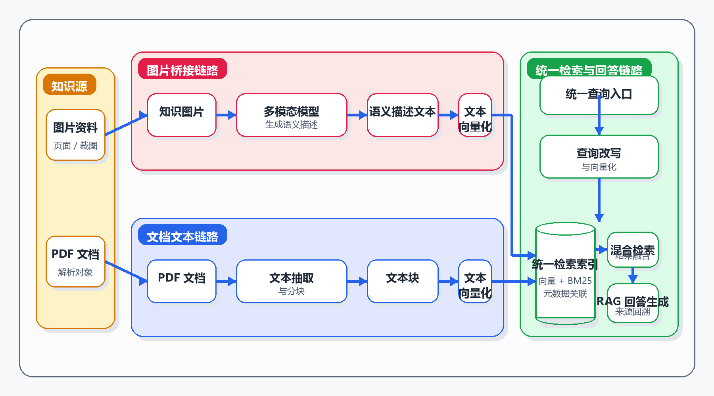
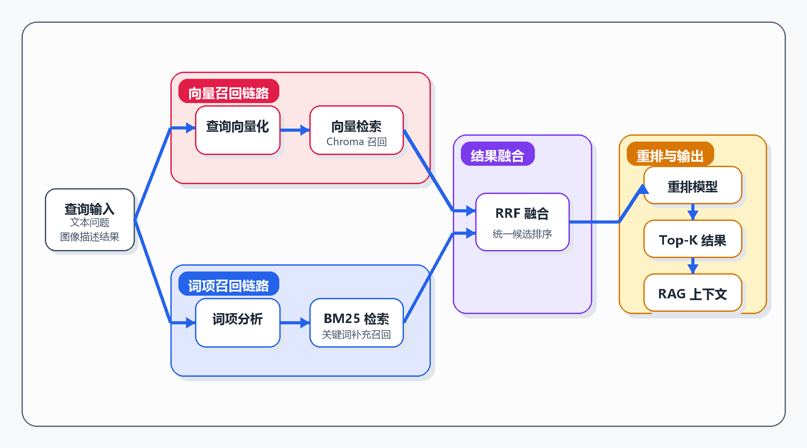

# 2 关键技术介绍

## 2.1 多模态大模型与图像语义描述

本项目的核心切入点不是直接把图像向量作为唯一检索基础，而是先利用多模态大模型生成语义描述。这样做有两个工程上的直接好处。其一，图像中的对象、场景、文本区域和页面结构可以被整理成较完整的自然语言表示，后续更容易与文本检索流程衔接。其二，语义描述本身具有较好的可读性，在检索和问答结果解释时比纯向量更直观。近年来的 BLIP-2、LLaVA、Flamingo、InstructBLIP、Qwen-VL 和 Qwen2-VL 等模型，已经证明了视觉语言模型能够在图像描述、视觉问答和跨模态理解中提供较强的语义建模能力[3-4,8-9,15-18]。

在当前项目中，这一步并不是离线分析阶段单独存在的实验操作，而是系统入库与查询流程中的实际组成部分。无论是图片知识库构建，还是部分图像查询处理，系统都会先对图像生成描述，再将描述送入后续向量化和检索链路。也正因为这一设计，本文把“语义描述桥接”作为系统的核心方法，而不是把它视作单纯的数据预处理技巧[5-9,15-18]。

如图2-1所示，当前项目并不把图像描述看作可有可无的附加字段，而是把它作为图片资料进入统一检索与问答主链路之前的中间表示。图中的上路是图片资料经过多模态模型生成语义描述，再转成可索引文本；下路是 PDF 文档经过文本抽取与分块形成文本块。两条链路最终汇入同一套向量索引、BM25 检索和 RAG 问答流程，这也是后文系统设计与实现能够把图片知识库和文档知识库纳入相近检索结构的前提。

图2-1 语义描述桥接原理图

## 2.2 向量检索与文本检索

向量检索的基本思想是将数据对象映射到稠密向量空间，并通过相似度计算完成召回。对于图片检索和语义检索任务，向量方法能够较好地处理表述不一致但语义接近的样本，因此在多模态检索系统中应用广泛。以 CLIP、Sentence-BERT、DPR 和 M3-Embedding 为代表的方法，为图文对齐、稠密检索和长文本向量表示提供了比较成熟的技术基础[2,24-26]。

文本检索则更强调词项匹配和可解释性，典型代表是 BM25 一类方法。对于由语义描述、OCR 文本或用户问题组成的文本内容，BM25 能够补充向量检索在精确词项匹配方面的不足。特别是在文档场景中，某些关键词、专有名词和编号信息对召回具有直接作用，只依赖语义向量并不一定稳定[21,25-26]。

本项目没有将两者对立使用，而是把它们组织成互补关系。系统中既保存向量索引，也维护文本检索能力，使得检索过程可以先分别召回，再进行融合。这样既照顾到语义相似性，也能兼顾显式词项命中[21,24-26]。

## 2.3 混合检索、融合与重排

混合检索是当前项目中提升召回稳健性的关键环节。依据代码实现，系统在检索时会综合使用向量检索和 BM25 检索，再通过倒数排序融合方法整合候选结果。该做法的目的并不是机械叠加多个得分，而是在不要求不同检索器分数同尺度的情况下，对高排名结果进行统一排序[21-22]。

在候选集合形成之后，系统还会继续执行重排。重排阶段使用更强的匹配模型重新评估查询与候选项之间的相关性，从而把更可能满足用户真实意图的结果提前。对于多模态知识库这类资料异构性较强的场景，仅依赖初次召回往往容易出现“召回到了但排序不理想”的问题，加入重排后可以改善最终展示和问答使用的上下文质量。BERT 重排、稠密检索和多阶段召回方案为这一类设计提供了较直接的参考[23-24]。

此外，当前系统还支持查询改写。对于表达较短、含糊或口语化的问题，改写可以先对查询做语义补全或规范化，再交给后续召回模块处理。这个步骤并不是所有请求都强制执行，而是作为可配置能力存在，体现了系统在工程实现上对检索质量和响应开销之间的平衡[1,19-20,23-24]。

图2-2展示了本文所采用的混合检索基本逻辑。无论查询最初来自文本输入还是图像桥接描述，系统最终都会进入双路召回、融合与重排流程。这样的设计减少了“图像检索一条链、文档检索另一条链”的割裂感，也让后续来源回溯和 RAG 上下文组织能够复用一套相对稳定的中间结构。

图2-2 混合检索与结果融合原理图

## 2.4 检索增强生成与会话化问答

检索增强生成（Retrieval-Augmented Generation，RAG）强调先从外部知识库中获取与问题相关的上下文，再将其送入生成模型形成回答。与完全依赖模型参数的直接回答相比，RAG 更适合处理与项目内部资料、上传文件或特定知识库相关的问题。REALM、RAG 和 RETRO 等工作已经说明，把外部检索能力引入语言模型能够在知识密集型任务中提供更稳定的事实支撑；近年来的多模态 RAG 研究则进一步把这一思路扩展到图像、文档和混合媒体场景[1,5-7,19-20]。

本项目中的 RAG 不只是“把检索结果拼接到提示词里”这么简单。从代码结构可以看出，系统在问答流程中保留了来源信息、候选结果和部分检索步骤，用于支持答案解释和前端展示。前端聊天页面能够展示来源图片和检索轨迹，这意味着系统设计已经将“可追溯”纳入了问答体验，而不仅仅关注回答本身是否生成出来[1,5-7]。

同时，系统还带有会话管理机制。聊天记录以会话形式存储，用户可以在不同主题之间切换，历史消息也能够作为上下文的一部分参与后续问答。这种设计更接近真实使用情境，也使系统从单轮问答工具发展为可持续交互的知识服务界面。

## 2.5 PDF 文档解析与分块处理

除了图片资料，本项目还处理 PDF 文档。文档场景的难点在于：可用于检索和问答的信息并不只存在于连续文本中，还可能分布在图像、图表、页眉页脚和跨页表格等位置。如果只把整份文档当成普通文本文件处理，很容易造成语义片段丢失或粒度不合理。围绕文档理解，既有工作包括基于 OCR 的 PP-OCR、基于版面建模的 LayoutLM/LayoutLMv3，以及 OCR-free 的 Donut 和面向学术文档解析的 Nougat 等路线[10-14]。

当前项目在文档解析中采用了两条并行思路。一条是文本解析链路，利用 PDF 解析工具抽取文本并进行句子感知分块，使每个块既保留相对完整语义，又不会过长。另一条是视觉内容提取链路，用于抽取页面中的图像、表格裁剪结果以及必要的整页渲染图像。这样得到的结果既能进入后续知识库索引，也能为多模态问答提供更贴近原始页面的信息。相关公开数据与工具链也说明，文档页面的理解往往需要同时考虑文本、布局和视觉元素，而不是只做单一路径的信息提取[11-14,27-30]。

从系统定位来看，文档解析并不是独立于多模态知识库之外的附属功能，而是把“语义描述桥接”和“多来源知识组织”进一步扩展到文档资料场景的重要支撑[6-7,11-14,27-28]。

## 2.6 本章小结

本章介绍了与项目实现直接相关的关键技术。本文采用的技术路线可以概括为：利用多模态大模型生成图像语义描述，以此作为桥接表示接入文本侧索引与检索流程；在召回阶段结合向量检索、BM25、融合与重排；在问答阶段采用可追溯的 RAG 链路；在文档侧通过文本抽取和视觉内容提取共同支撑知识入库。后续章节将在此基础上展开系统分析、设计和实现说明。
