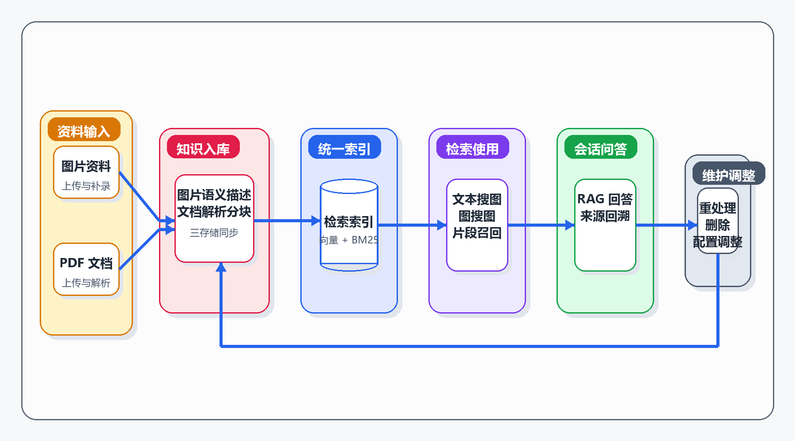

# 3 系统分析

## 3.1 应用场景分析

结合当前项目的实现，系统主要面向两类资料使用场景。

第一类是图片资料管理与检索场景。用户上传图片后，希望系统能够自动生成描述、完成索引构建，并支持通过文本查询或相似图片查询快速找到相关资料。这类场景常见于图片档案整理、样例库维护和视觉资料快速定位等任务。

第二类是文档资料问答场景。用户上传 PDF 文档后，希望系统能够解析其中的文本、图像和表格信息，并在后续问答中基于这些内容给出较为可靠的回答。与普通网页问答不同，文档问答需要处理版式复杂、页面跨度大、视觉信息占比较高的内容，因此对解析和检索链路的要求更高。

从前端页面和后端接口可以看出，系统并不是单一工具，而是围绕“知识入库、检索使用、问答服务、结果管理”组织起来的一整套流程。用户既可以单独进入检索页面，也可以直接在会话页面结合知识库内容进行提问。

如果从实际使用链路来看，图片资料场景通常表现为“上传图片并生成描述 - 建立索引 - 通过文本或示例图检索目标资料 - 在结果页或聊天页继续追问”；文档资料场景则更接近“上传 PDF - 后台解析文本和视觉内容 - 查询解析进度 - 在问答中引用文档片段和页面图像作答”。因此，系统分析不能只停留在功能罗列上，还需要说明这些功能如何围绕同一条任务链协同工作。

如图3-1所示，图片资料检索和文档问答虽然入口不同，但最终都汇入“入库 - 检索 - 问答 - 维护”这条主任务链。也正因为系统面对的是一条持续运转的链路，而不是若干孤立按钮，本章后续的功能需求和非功能需求才会围绕一致性、可解释性和可扩展性展开。

图3-1 系统业务场景与任务链图

## 3.2 功能需求分析

依据后端路由和前端页面，系统当前的核心功能需求可整理为表 3-1 所示内容。

| 编号 | 功能需求 | 具体说明 |
| --- | --- | --- |
| F1 | 图片知识库管理 | 支持图片上传、列表查看、详情查看、编辑、删除和重处理 |
| F2 | 文档知识库管理 | 支持 PDF 上传、解析进度查询、结果查看、重处理和删除 |
| F3 | 文本搜图 | 用户输入文本问题，系统返回相关图片结果 |
| F4 | 图搜图 | 用户上传图片，系统返回相似图片结果 |
| F5 | 会话化问答 | 支持基于知识库的多轮问答，并保存历史会话 |
| F6 | 来源回溯 | 对问答结果给出来源图片、来源文档片段或检索轨迹 |
| F7 | 检索链路配置 | 支持 BM25 重建和部分系统配置调整 |
| F8 | 状态与进度反馈 | 上传、解析、重处理等耗时操作需要提供状态反馈 |

这些功能并不是纸面需求，而是已经体现在当前系统代码中的实际能力。例如，图片知识库和文档知识库分别对应独立页面与路由；会话问答不仅能返回回答，还能返回来源信息和检索步骤；管理端还提供了索引重建和配置更新接口。

从任务衔接关系看，F1 和 F2 解决的是知识单元能否顺利入库，F3 和 F4 对应检索入口，F5 和 F6 决定问答结果是否可用、可追溯，F7 和 F8 则保障索引与状态能够持续维护。也就是说，这些需求不是彼此孤立的模块清单，而是由“先入库，再检索，再问答，再维护”这一实际使用过程推导出来的设计约束。

## 3.3 非功能需求分析

对于本项目这类工程型系统，仅有功能完整还不够，还需要满足若干非功能需求。

### 3.3.1 易用性需求

系统前端需要提供直观的操作入口。结合现有页面实现，用户可以通过独立页面完成上传、检索和问答，不需要直接接触后端接口。列表、预览、进度显示和消息提示等交互设计，都是为了降低系统使用门槛。

### 3.3.2 可解释性需求

检索与问答结果如果无法说明来源，用户很难判断答案是否可信。因此系统需要保留来源信息、候选结果和检索轨迹。当前聊天页面已经具备来源展示和检索步骤展示能力，这一需求在实现中得到了明确体现。

### 3.3.3 一致性需求

系统同时维护 SQLite 元数据、向量库和本地文件存储。若三者之间的标识不一致，就会出现“数据库有记录但文件缺失”或“文件存在但索引未同步”等问题。因此系统需要保证三存储之间的 ID 关联一致，并在删除、重处理等操作中维持同步。

### 3.3.4 可扩展性需求

项目已经从图片知识库扩展到文档知识库，这说明系统设计不能只适配单一数据类型。后端需要通过相对清晰的模块边界支持后续增加新的解析流程、检索策略或模型配置。当前代码中适配器层、检索层和应用层的划分，正是为了支撑这种扩展。

### 3.3.5 响应效率需求

知识库操作和问答调用都涉及模型推理、向量检索和文件处理。系统虽然不以极限吞吐量为目标，但在交互层面仍然需要保持可接受的响应时间。实验章节中记录的平均检索时延可以作为这一需求的离线参考；在前端实现上，解析进度、异步处理和状态提示则缓解了长耗时操作带来的使用压力。

## 3.4 可行性分析

### 3.4.1 技术可行性

从现有实现看，本项目所依赖的关键技术均已具备落地条件。后端使用 FastAPI 提供服务接口，前端使用 Vue 3 组织交互页面；图片和文档的知识入库均已有代码实现；离线评测脚本和结果文件也已形成较完整的验证链路。因此，系统不是停留在设计层面的方案，而是具有实际可运行基础。

### 3.4.2 业务可行性

项目聚焦于“资料入库后如何检索和使用”这一明确问题，业务边界比较清晰。系统不需要覆盖通用办公平台的全部功能，而是围绕知识库管理、检索和问答三个核心任务展开，适合作为本科毕业设计的工程实践对象。对论文而言，这样的业务边界也意味着后续设计应优先保证任务链闭环，而不是继续堆叠与主问题关系较弱的外围功能。

### 3.4.3 实验可行性

项目目录中已包含检索实验、生成实验和微调实验的脚本与结果产物，说明论文中的实验分析有可追溯依据。尤其是 UniDoc-Bench 跨域评测和 COCO 子集评测，为不同场景下的方法比较提供了基础材料。

## 3.5 本章小结

本章从应用场景、功能需求、非功能需求和可行性四个方面分析了系统建设的必要性和可行性。综合来看，系统需要解决的核心问题并不是单一的图像检索或单一的问答，而是如何在图片资料和文档资料并存的条件下，把上传、解析、索引、检索、问答和结果回溯组织成一条可持续运行的任务链。下一章将在这些分析基础上进一步说明系统设计方案。
