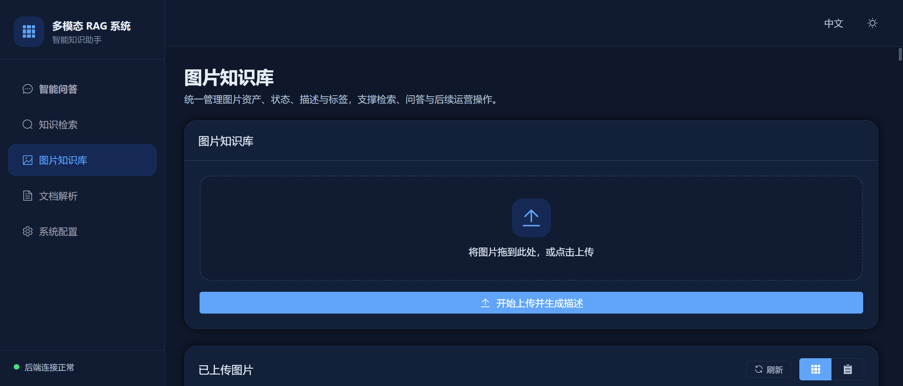
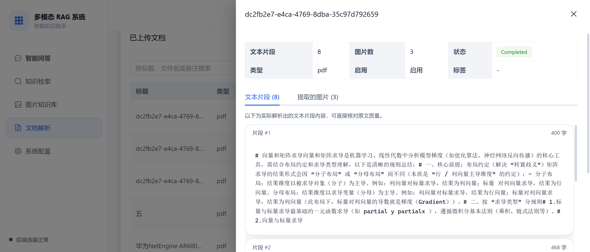
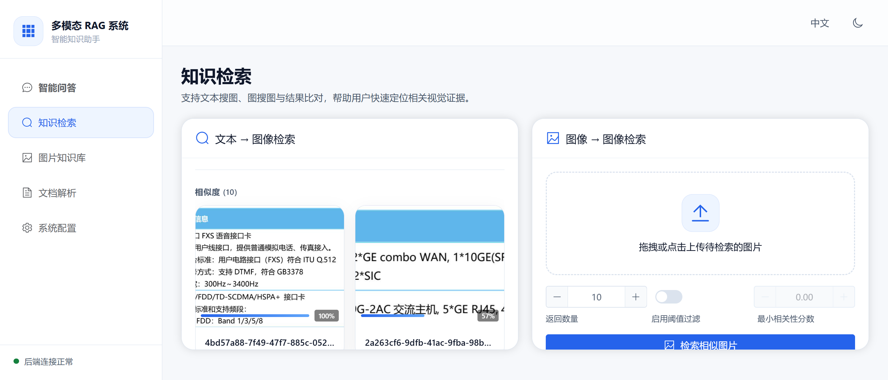
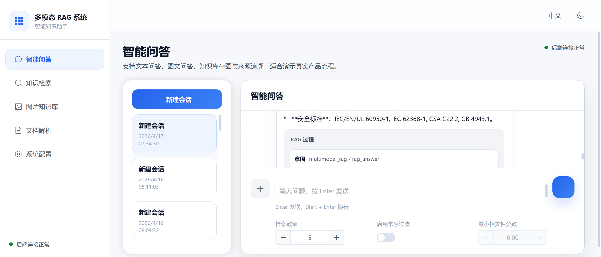

# 5 系统实现

## 5.1 后端服务实现

后端采用 FastAPI 作为服务框架，入口文件负责注册知识库、检索、问答、文档和管理等接口。与直接在路由层堆叠大量业务逻辑的做法不同，当前项目将主要处理流程下沉到应用层、检索层和适配器层。这样做的好处是接口文件保持相对简洁，路由主要负责参数接收、响应组织和异常转换，而具体处理细节由后端内部模块完成。系统在工程实现上还借助了 LangChain 与 Chroma 的相关能力组织向量检索和链路适配，因此整体实现既依赖 Web 服务框架，也依赖面向 RAG 的检索集成组件[31-35]。

从工程结构看，后端主要分为以下几类模块：

- `api/routers`：对外接口定义。
- `application`：知识管理、文档解析、聊天编排等业务逻辑。
- `retrieval`：检索策略、召回与重排。
- `data`：数据库模型和持久化对象。
- `langchain_integration`：统一适配检索与问答调用。

这一划分与前文的设计分析一致，说明系统实现没有偏离总体架构。

## 5.2 图片知识库实现

### 5.2.1 图片上传与元数据管理

图片知识库后端接口支持图片上传、列表查询、详情查看、更新、删除和重处理。图片上传后，系统先将原始文件保存到本地存储，再为每条记录生成唯一标识。数据库中保存的图片元数据不仅包括文件路径和上传时间，还包括自动生成的描述、状态、来源数据集、标题、标签、备注以及扩展元数据等字段。

这些字段设计表明，图片知识库并不只是用于实验数据暂存，而是面向实际管理场景构建的资料库。标题、标签和备注等字段为后续人工维护预留了空间，自动生成描述则承担了知识语义化和检索桥接的双重作用。

### 5.2.2 语义描述生成与索引构建

在图片上传流程中，系统会调用多模态模型对图片生成语义描述。该描述写入数据库后，还会被送入向量库建立索引，并参与 BM25 文本检索侧的数据维护。与直接把图片文件本身作为唯一检索对象相比，这种实现使图片在系统内部拥有了可读、可检索、可解释的语义表示。当前项目涉及的视觉描述和嵌入接口主要依赖 Model Studio 视觉能力、Qwen API 以及文本和多模态嵌入接口，向量化侧则结合 BGE-M3 及其模型卡和实际配置完成工程落地[26,36-40]。

从实现逻辑看，语义描述生成并不是实验阶段临时加入的附属模块，而是系统主干流程的一部分。因此在论文中应将其视为核心实现点，而不是背景性说明。

### 5.2.3 图片记录更新与重处理

系统支持对图片记录进行编辑和重处理。编辑操作主要影响标题、标签、备注和启用状态等元数据；重处理则可在需要时重新生成描述或重建索引。这一能力对于实际使用很重要，因为多模态模型生成的描述并不一定始终满足后续检索需求，系统需要保留修正和再处理入口，而不是把首次生成结果视为不可变内容。

## 5.3 文档知识库实现

### 5.3.1 文档上传与任务启动

文档知识库接口支持 PDF 上传。上传请求到达后，系统首先创建文档记录，记录中保存文件名、标题、路径、状态、分块数、图像数、文档类型、解析后端以及进度信息等字段。随后，系统启动后台解析任务。

这种实现方式避免了用户在前端长时间等待整份文档完成处理。文档一旦上传成功，就可以在列表中看到记录，并通过进度接口持续观察解析状态。

### 5.3.2 文本抽取与句子感知分块

文档解析的文本链路基于 PDF 解析工具完成文本抽取。抽取出的内容不会直接按固定字数粗暴切分，而是进一步进行句子感知分块。这样的做法更适合后续检索和问答，因为每个块在语义上相对完整，不容易出现一句话被切断或者多个无关片段被强行拼接的问题。当前实现使用的 PDF 处理能力直接建立在 PyMuPDF 相关文档和教程所支持的文本抽取与页面处理机制之上[29-30]。

在当前项目中，文档块数量也会写回元数据，便于在前端查看和后续调试。这一点体现出实现不仅关注功能可用，也保留了必要的可观测性。

### 5.3.3 图像、表格与页面视觉内容提取

除了文本抽取，系统还会从 PDF 中提取页面图像、表格裁剪结果以及必要的整页渲染图。这一部分实现说明项目并未把文档完全退化为纯文本材料，而是尽量保留与页面视觉结构相关的信息。对于含表格、图示或页面布局较强的文档，这种设计能为后续问答提供更贴近原始资料的上下文。

### 5.3.4 文档知识同步与进度更新

解析完成后，系统会将文档分块和视觉内容同步到知识库，并持续更新解析阶段、状态和进度百分比。前端页面据此展示进度条、状态文本和处理结果。整个流程体现出文档知识库的实现重点不只是“上传成功”，而是“上传后可被继续追踪、检索和使用”。

## 5.4 检索功能实现

### 5.4.1 文本检索链路

文本检索链路首先接收用户查询，然后根据系统配置决定是否执行查询改写。改写后的查询会分别送入向量检索和 BM25 检索通路。系统取得两路候选结果后，通过倒数排序融合统一排序，再使用重排模型进一步筛选。最终结果既可以直接返回给检索页面，也可以作为问答模块的输入上下文。这一实现同时吸收了 BM25、倒数排序融合、BERT 重排以及向量表示模型的典型设计思路，并通过 Chroma 与 LangChain 集成文档组织成工程可运行链路[21-23,26,32-35,40]。

该实现体现了一个明确思路：单一路径召回很难兼顾语义相似与关键词匹配，因此需要把向量检索和文本检索结合使用。从代码事实看，这一思路不是论文中的理论假设，而是已经落地的实际流程。

### 5.4.2 图像检索链路

图像检索并不维护完全独立的一套召回逻辑。系统会先对输入图片生成语义描述，再把这段描述送入文本检索链路。这样做使图像检索和文本检索共用一套召回、融合和重排流程，减少了系统内部流程分叉，也让图像查询结果更容易解释。

对于论文题目中的“语义描述桥接”，这一实现正是最直接的代码支撑。因为桥接不仅发生在知识入库阶段，也发生在用户用图像作为查询时的检索阶段。

## 5.5 会话化问答实现

### 5.5.1 会话与消息管理

系统为每个聊天主题创建独立会话，并保存消息内容。用户可以创建、切换和删除会话，前端页面也保留了草稿和当前消息状态。这种会话管理能力使系统更适合围绕同一批资料进行连续提问，而不是把所有问题都当作孤立请求处理。

### 5.5.2 多种执行模式编排

聊天模块并不把所有请求都强制走 RAG 路线。依据输入内容和是否携带图片，系统会识别不同执行模式，包括直接回答、上传图片问答、保存上传图片、相似图像检索、图像支撑回答和多模态 RAG 等。这样的实现减少了不必要的检索开销，也使不同交互场景能够使用更合适的处理方式。

### 5.5.3 来源回溯与检索轨迹

在需要检索的问答场景中，系统不仅返回最终答案，还返回来源快照和检索步骤。前端聊天页面据此展示来源图片、模式标识和部分检索轨迹。这一能力提升了系统结果的可解释性，也便于用户判断当前答案是否建立在真实知识库内容之上。

## 5.6 前端交互实现

### 5.6.1 图片知识库页面

图片知识库页面集成了上传区、筛选条件、网格或表格展示、详情预览、编辑、重处理和删除操作。该页面对应后端图片知识库接口，是用户维护图片资料的主要入口。前端整体采用组件化页面组织方式实现列表、表单和状态提示，并通过统一的路由和接口封装把图片管理流程串联起来。

图5-1给出了当前系统中图片知识库页面的真实界面。页面上半部分保留上传入口，下半部分展示已入库图片、语义描述摘要和基础管理操作。这种布局能够同时兼顾“新图片入库”和“已有图片维护”两类常见使用动作。

图5-1 图片知识库页面截图

### 5.6.2 文档知识库页面

文档知识库页面支持 PDF 上传、解析进度查看、列表浏览和结果查看。由于文档解析是异步流程，因此该页面在交互上更强调状态可视化，这与后端的进度更新机制相呼应。

如图5-2所示，文档知识库页面不仅展示文档列表，还支持查看解析结果抽屉。用户可以在同一工作区中看到上传状态、文档完成情况、文本片段数量和提取图片数量，这比把解析结果拆到独立页面更便于核对文档入库质量。

图5-2 文档知识库与解析结果页面截图

### 5.6.3 检索页面

检索页面提供文本搜图和图搜图两种入口，返回结果以卡片形式展示，并支持图片预览。页面结构相对集中，便于用户快速验证查询结果，也便于在实验演示中体现系统主要检索能力。

图5-3展示了检索页面的实际效果。页面左侧为文本搜图入口，右侧为图搜图入口，查询参数和结果区域被放在同一屏内，便于用户快速调整返回数量、过滤阈值并观察召回结果。

图5-3 检索页面截图

### 5.6.4 聊天页面

聊天页面支持多会话管理、图片附加、答案展示、来源图片展示和检索轨迹查看。与单纯的聊天框相比，该页面更强调资料问答的上下文和证据感，这是本项目与普通对话应用的一个实际差别。

如图5-4所示，聊天页面将答案内容、来源图片和检索轨迹放在同一交互界面中。用户不仅能看到最终回答，还能进一步展开 RAG 过程查看查询、检索和评分信息，这一设计直接支撑了论文前文所强调的可解释性目标。

图5-4 聊天页面与来源回溯截图

## 5.7 管理与稳定性实现

系统提供 BM25 重建、配置读取和配置更新能力，用于支持索引维护和参数调整。与此同时，知识管理模块在系统启动时会检查并补齐部分数据字段，在删除流程中也会限制操作范围，避免误删超出存储根目录的文件。虽然这些实现不直接体现为用户可见功能，但对系统稳定运行和数据安全具有基础作用。

## 5.8 本章小结

本章围绕真实代码说明了多模态 RAG 系统的具体实现。整体来看，系统并不是简单地把若干接口和页面拼在一起，而是在图片入库、文档解析、混合检索和会话问答之间建立了较完整的工程闭环。其中，语义描述生成及其在索引和查询中的复用，是系统实现与论文题目最直接对应的关键点。
