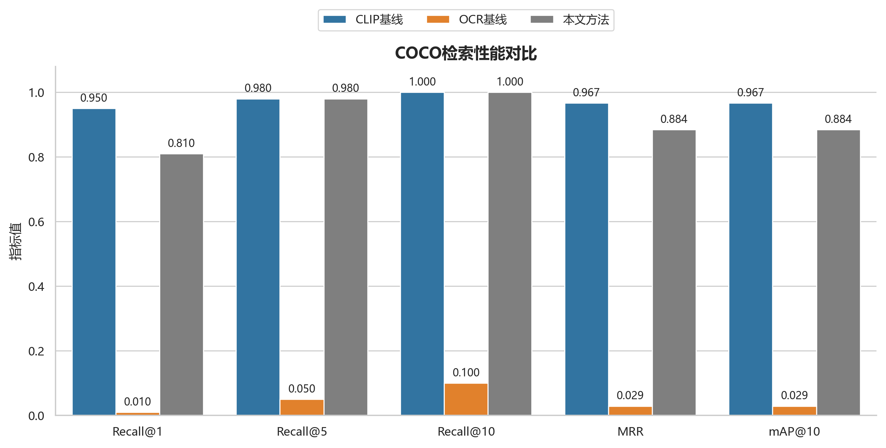
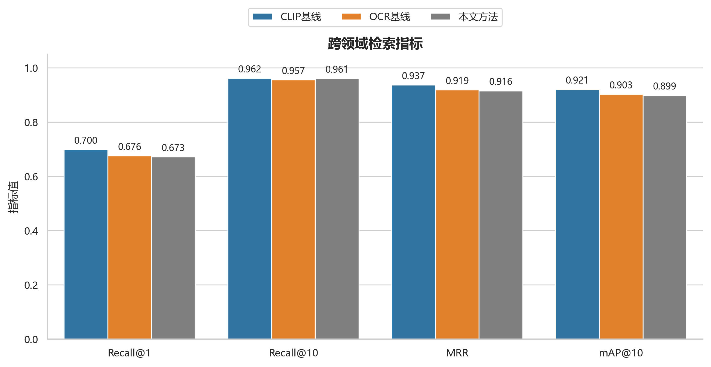
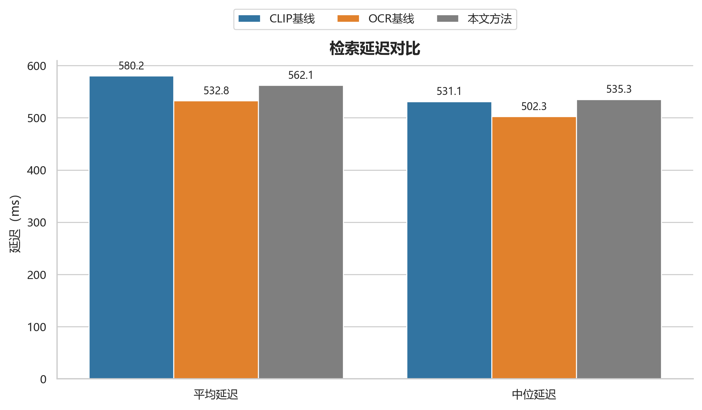
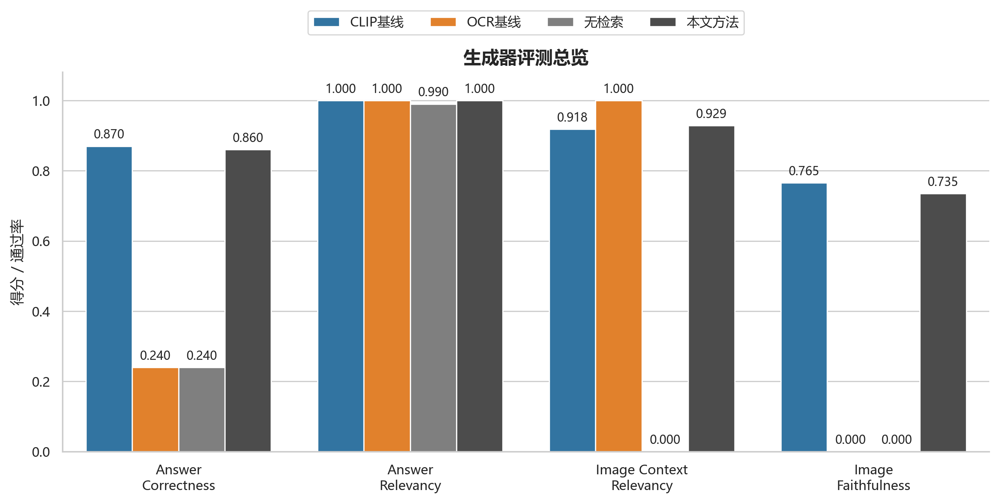
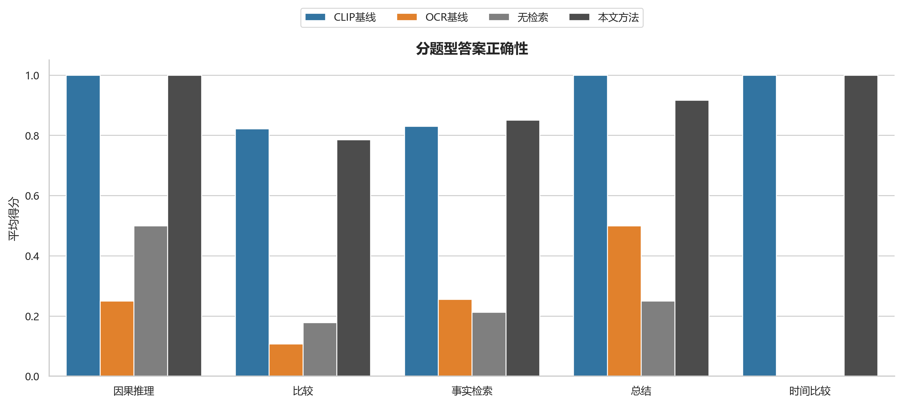
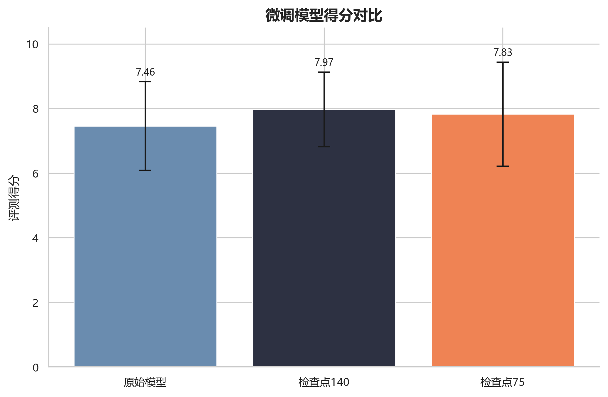
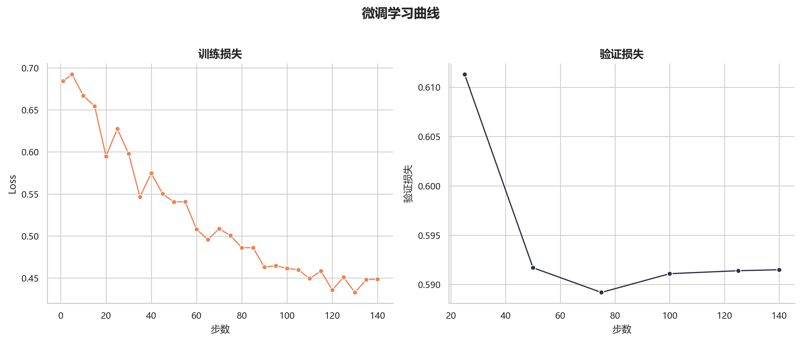

# 6 实验设计与结果分析

## 6.1 实验目标

本章实验的目的主要有三点。

1. 验证语义描述桥接方法在图像检索和文档图像检索场景中的表现。
2. 比较不同检索路径对多模态问答结果的影响，观察检索是否能够为答案提供有效支撑。
3. 在已有补充实验的基础上，分析微调模型在当前任务上的表现变化，为后续优化方向提供参考。

需要说明的是，本文所有实验结论均来自项目目录中的真实脚本和结果文件，不补写不存在的对比组，也不虚构未运行过的指标。

## 6.2 实验材料与评价方式

### 6.2.1 实验运行说明

本文检索与生成实验均基于 `evaluation` 目录中的离线脚本执行，正文表格和分析结论来自项目中已经保存的汇总结果、评分结果和原始日志文件，而不是在论文撰写阶段重新补跑得到的临时结果。检索部分主要依赖 `run_unidoc_full_eval.py` 及相关方法脚本，生成部分主要依赖 `run_unidoc_gen.py` 和 `run_unidoc_score.py`。因此，后文中的方法比较和数值结论都可以回溯到本地脚本与结果文件。

需要说明的是，当前本地材料没有完整保留一套统一的检索与生成实验硬件说明，因此本文不单独列出 CPU、GPU 和内存环境表。涉及平均时延的指标，仅用于同一批次离线实验内部的相对比较，不将其外推为跨设备、跨环境的绝对性能结论。

微调补充实验的可证实运行线索来自已保存的训练日志和配置文件。相关材料显示，该实验通过 `/usr/local/bin/python` 调用 Python 3.11 环境中的 Swift CLI `sft.py` 执行，基础模型为 `Qwen3.5-4B`，采用 LoRA 方式训练，并启用了 `bfloat16` 与 `flash_attn` 等配置。由于同样缺少完整硬件清单，正文只保留这些可直接核实的运行事实。

### 6.2.2 实验数据与任务设置

当前项目中的离线实验主要覆盖两类数据场景。

一类是 COCO 子集评测集，用于观察不同方法在通用图像检索任务上的表现。另一类是 UniDoc-Bench 跨域评测集，用于观察不同方法在文档图像场景中的检索与问答表现。结合结果文件和分析报告，UniDoc 场景更贴近本文“文档知识库 + 多模态问答”的扩展应用，因此后文会将其作为重点分析对象[27-28]。

检索实验主要比较以下三种方法：

- 语义描述桥接方法（proposed）
- 多模态向量基线（baseline_clip）
- OCR 文本基线（baseline_ocr）

生成实验在上述三种方法之外，还加入无检索生成基线（no_rag），用于观察不接入知识库时的回答表现。需要说明的是，当前目录中已经保存的生成实验结果对应的是 UniDoc subset100 批量结果，而不是 COCO 生成实验结果，因此正文只分析这些已有证据支持的内容。

微调实验使用项目中已经保存的三个模型状态：

- Base
- Ckpt75
- Ckpt140

### 6.2.3 评价指标

检索实验采用 `evaluation/metrics.py` 中实现的指标，主要包括：

- Recall@1、Recall@5、Recall@10：衡量正确结果是否出现在前 K 个返回项中。
- MRR：衡量正确结果平均出现在多靠前的位置。
- mAP@10：衡量前 10 个结果整体排序质量。
- 平均检索时延：衡量离线检索流程的响应开销。

这些指标与现有检索研究中常见的召回、排序和重排评价口径保持一致，能够较直接地反映不同检索方法在候选召回和排序阶段的差异[21-24]。生成实验评分脚本包含多个维度。结合当前汇总结果，本文重点使用以下四个指标：

- 答案正确性（answer_correctness）
- 答案相关性（answer_relevancy）
- 图像上下文相关性（image_context_relevancy）
- 图像忠实度（image_faithfulness）

其中，答案正确性以平均分方式统计，其余若干维度按通过率汇总。由于当前 UniDoc 生成评分过程中并未提供完整文本上下文，文本相关指标在结果文件中被跳过，因此正文不对缺失指标做主观推断。

### 6.2.4 实验执行流程

检索实验通过 `run_unidoc_full_eval.py` 及相关方法脚本执行。该流程会在统一候选集合上分别运行 `proposed`、`baseline_clip` 和 `baseline_ocr` 三种方法，并输出总体结果、分领域结果和分问题类型结果。UniDoc 数据覆盖 `commerce_manufacturing`、`construction`、`crm`、`education`、`energy`、`finance`、`healthcare` 和 `legal` 八个领域，跨域评测时将它们合并到统一候选池中。

生成实验通过 `run_unidoc_gen.py` 和 `run_unidoc_score.py` 执行。前者负责调用不同检索路线获得候选内容并生成回答，后者负责对回答结果进行评分和汇总。当前保存的结果文件采用跨域检索设置，即先从跨域候选池中检索相关图像，再交由模型生成回答。

微调实验的正文分析不重复训练过程，而是基于已有的训练日志、评分表和分析报告，对不同检查点的平均得分和稳定性进行补充说明。

## 6.3 检索实验结果与分析

### 6.3.1 COCO 子集检索结果

表 6-1 给出了 COCO 子集评测集上的主要结果。

| 方法 | Recall@1 | Recall@5 | Recall@10 | MRR | mAP@10 | 平均时延/ms |
| --- | ---: | ---: | ---: | ---: | ---: | ---: |
| baseline_clip | 0.9500 | 0.9800 | 1.0000 | 0.9667 | 0.9667 | 580.1909 |
| baseline_ocr | 0.0100 | 0.0500 | 0.1000 | 0.0293 | 0.0293 | 532.7646 |
| proposed | 0.8100 | 0.9800 | 1.0000 | 0.8844 | 0.8844 | 562.0936 |

从表中可以看出，在 COCO 这一通用图像场景下，多模态向量基线整体表现最好，尤其是在 Recall@1 和 MRR 上明显高于语义描述桥接方法。语义描述桥接方法虽然在 Recall@5 和 Recall@10 上与 `baseline_clip` 接近，但排序质量仍有差距。OCR 文本基线在该场景下表现较弱，这与通用图像中可稳定提取文本信息较少的特点一致。

这一结果说明，在自然图像检索任务中，直接使用多模态向量仍然具有很强竞争力。对本文而言，这不是负面结论，而是帮助厘清方法适用边界：语义描述桥接方法并不是为了在所有开放图像任务上替代多模态向量，而是为了在需要统一接入文本检索、文档解析和 RAG 链路的工程场景下提供更稳定的桥接表示。

图6-1把 COCO 子集上的主要检索指标可视化之后，这一差异会更直观。`baseline_clip` 在首位命中和整体排序质量上都更突出，而 `proposed` 更像是在保持中后段召回能力的同时牺牲了部分前位排序。

图6-1 COCO 检索指标对比图

### 6.3.2 UniDoc 跨域检索结果

表 6-2 给出了 UniDoc-Bench 跨域评测集上的总体结果。

| 方法 | Recall@1 | Recall@5 | Recall@10 | MRR | mAP@10 |
| --- | ---: | ---: | ---: | ---: | ---: |
| baseline_clip | 0.6995 | 0.9413 | 0.9623 | 0.9371 | 0.9209 |
| baseline_ocr | 0.6764 | 0.9348 | 0.9565 | 0.9193 | 0.9033 |
| proposed | 0.6726 | 0.9367 | 0.9611 | 0.9158 | 0.8989 |

与 COCO 类似，`baseline_clip` 在 UniDoc 跨域检索总体指标上仍然领先。但不同于 COCO，三种方法之间的差距明显缩小。`proposed` 在 Recall@10 上达到 0.9611，与 `baseline_clip` 的 0.9623 已较为接近；在 Recall@5 上也保持在 0.9367。相比之下，OCR 文本基线虽然在文档场景中有所改善，但总体上仍略低于前两者。

这一结果带来两个值得注意的观察。第一，进入文档图像场景后，语义描述桥接方法与直接多模态向量方法的差距缩小，说明桥接表示对文档页面语义的保留具有一定有效性。第二，纯 OCR 路线虽然能利用文本信息，但在跨域候选池中仍然受到识别误差和版面信息损失的影响。

从论文叙述角度看，UniDoc 结果更适合作为正文重点，因为它与系统中的文档知识库和多模态问答场景更接近，也更能体现语义描述桥接方法的工程价值。

如图6-2所示，进入文档图像场景后，三种方法之间的差距明显缩小。尤其在 Recall@10 上，`proposed` 与 `baseline_clip` 已经十分接近，这也是本文在后续系统分析中更重视文档场景而不是只强调通用自然图像场景的原因。

图6-2 UniDoc 跨域检索指标对比图

### 6.3.3 检索结果讨论

综合两个数据场景，可以得到较为稳妥的判断：

1. 在当前实验设置下，`baseline_clip` 是检索指标上的最强基线，尤其在通用图像场景中优势更明显。
2. 语义描述桥接方法在文档场景中与 `baseline_clip` 的差距缩小，说明通过语义描述把图像统一到文本检索链路是可行的。
3. OCR 文本基线没有在现有结果中表现出明显优势，表明仅依赖 OCR 文本不足以覆盖多模态资料场景。

因此，本文不会把语义描述桥接方法表述为“检索指标全面最优”，而是把它定位为一种更适合系统统一实现、可解释性和跨模块衔接的工程方案。

之所以在本文中仍把语义描述桥接作为主方法，并不是因为它在所有检索指标上都超过了 `baseline_clip`。更直接的原因在于，当前系统同时要处理图片知识库、文档知识库和会话问答三类链路，桥接表示能够把图片资料和文档片段统一送入相近的文本检索与证据组织流程中。相比单独维护一条更强但更割裂的检索支路，这种做法与系统整体实现更一致，也更便于展示来源和解释中间过程。

检索时延结果如图6-3所示。结合前文的限制说明，这里的时延只用于同批次离线实验内部比较，不作为跨设备绝对性能结论。从当前结果看，不同方法之间的时延差异存在，但并没有大到足以改变本文对系统主方法的判断，真正更关键的仍然是能否和系统整体链路稳定衔接。

图6-3 检索时延对比图

## 6.4 生成实验结果与分析

### 6.4.1 生成实验总体结果

生成实验结果如表 6-3 所示。

| 方法 | 答案正确性 | 答案相关性 | 图像上下文相关性 | 图像忠实度 |
| --- | ---: | ---: | ---: | ---: |
| baseline_clip | 0.8700 | 1.0000 | 0.9184 | 0.7653 |
| baseline_ocr | 0.2400 | 1.0000 | 1.0000 | 0.0000 |
| no_rag | 0.2400 | 0.9900 | - | - |
| proposed | 0.8600 | 1.0000 | 0.9286 | 0.7347 |

从结果可以看出，接入检索后的三种方法在答案正确性上明显优于 `no_rag`，其中 `baseline_clip` 为 0.87，`proposed` 为 0.86，而 `no_rag` 和 `baseline_ocr` 都只有 0.24。这表明，在当前任务设置下，仅依靠生成模型直接作答很难得到可靠答案，检索提供的知识上下文是必要的。

在图像上下文相关性上，`proposed` 达到 0.9286，略高于 `baseline_clip` 的 0.9184；在图像忠实度上，`baseline_clip` 为 0.7653，略高于 `proposed` 的 0.7347。两者的差距不大，说明语义描述桥接方法在生成场景中并没有明显破坏图像相关信息的使用效果。

需要注意的是，`baseline_ocr` 在答案相关性和图像上下文相关性上看似不低，但答案正确性和图像忠实度明显偏弱。这说明仅凭部分表面相关并不能保证回答真正建立在正确证据上，仍然需要结合答案正确性与忠实度综合判断。同时，当前结果文件中 `baseline_ocr` 的图像上下文相关性和图像忠实度实际上只基于极少量样本统计，因此这两个数值不宜作为其稳定优势来解读。

图6-4以图形方式展示了四种生成设置的总体差异。它进一步印证了一个较稳定的判断：是否接入检索，比在当前设置下具体选择哪一路检索方法更先决定问答是否可靠。

图6-4 生成总体指标对比图

### 6.4.2 生成结果讨论

生成实验带来的结论与检索实验并不完全相同。虽然 `baseline_clip` 在答案正确性上略高于 `proposed`，但两者差距很小，且都明显优于无检索生成。对系统实际应用而言，这意味着：

- 检索链路的存在比“使用哪一种检索方法”更先决定问答是否可靠。
- 语义描述桥接方法虽然在纯检索排序指标上不是最优，但接入问答流程后仍能提供较稳定的支撑效果。
- 由于 `proposed` 与系统中的文本检索、BM25 融合和文档解析链路天然更一致，因此其工程价值不应只用单一答案正确性指标评价。

换句话说，`baseline_clip` 在当前检索实验里依然是更强的结果基线，这一点在正文中需要明确保留；而本文继续采用语义描述桥接作为系统主方法，依据并不在于“它已经全面胜出”，而在于它更容易和文档解析、混合检索、来源回溯以及会话问答组合成一条统一链路。对于毕业设计这样的工程项目，这种系统级一致性比单点指标优势更值得被单独说明。

图6-5进一步给出了不同题型下的正确性对比。可以看到，不同检索方法在题型上的表现并不完全一致，这也说明本文没有把任何单一结果简单上升为“全面最优”结论，而是更关注它们在整体系统链路中的实际适配性。

图6-5 不同题型生成正确性对比图

## 6.5 微调补充实验分析

### 6.5.1 平均得分结果

项目中保存的微调分析报告给出了三个模型状态在 46 个验证样本上的平均得分，结果如表 6-4 所示。

| 模型状态 | 平均得分 |
| --- | ---: |
| Base | 7.457 |
| Ckpt75 | 7.826 |
| Ckpt140 | 7.971 |

从平均得分来看，两个检查点都优于基础模型，其中 Ckpt140 最高，Ckpt75 次之。这说明在当前任务和评分方式下，适度微调能够带来一定收益。

图6-6把三个模型状态的平均得分差异可视化之后，可以更直观看到 Base、Ckpt75 和 Ckpt140 之间的整体变化趋势。就现有结果而言，微调确实带来了提升，但提升幅度仍然应按补充验证来理解，而不是把它写成与系统主实验同等重要的独立研究结论。

图6-6 微调总体得分对比图

### 6.5.2 稳定性分析

虽然 Ckpt140 的平均分最高，但项目已有分析报告建议在论文中更保守地推荐 Ckpt75。原因在于，训练曲线显示 step 75 的验证损失已经较低，且已有分析认为 Ckpt75 在样本层面的波动更稳健，作为阶段性成果更适合用于论文中的补充说明。这一判断并不与结果矛盾，而是体现了工程评估中“平均效果”和“稳定性”需要同时考虑。

需要强调的是，微调实验属于补充验证内容，不构成本文系统主实验的主体。正文对其定位应保持克制，避免将其写成与主系统无关的独立研究线。

图6-7展示了训练过程中的学习曲线变化。结合平均得分表和已有分析报告，本文更倾向于把 Ckpt75 视为相对稳妥的阶段性检查点，而把 Ckpt140 的更高平均分作为补充参考，而不是直接据此得出“训练越久越好”的简单结论。

图6-7 微调学习曲线图

## 6.6 局限性讨论

结合当前实验结果，系统和方法仍然存在以下局限。

1. 语义描述桥接方法在检索指标上尚未超过多模态向量基线，尤其在 COCO 场景下差距较明显。
2. OCR 文本基线的表现说明，仅依赖 OCR 文本难以完整表达复杂图像和文档页面语义。
3. 生成实验虽然证明了检索的重要性，但当前评分结果仍主要集中在若干核心维度，后续还可以补充更细粒度的人机一致性评估。
4. 文档知识库和聊天系统已经实现，但其线上真实使用数据尚未形成长期统计，因此本文结论仍以离线实验和工程实现分析为主。

## 6.7 本章小结

本章基于项目中的真实实验脚本和结果文件，对检索、生成和微调补充实验进行了分析。总体来看，多模态向量基线在现有检索指标上仍然最强；语义描述桥接方法在文档场景中与其差距缩小，并在接入问答流程后表现出较稳定的支撑作用；无检索生成的表现明显较弱，说明知识库检索是当前系统回答质量的重要基础。这些结果与前文的系统设计和实现分析能够形成较完整的验证闭环。
